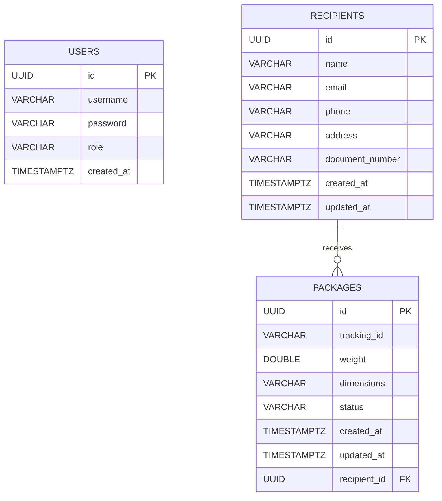

# Database Design (ERD)

This document describes the current PostgreSQL schema used by SmartShip.

## Entity Relationship Diagram

## Main Tables

- `users`: authentication and authorization users (`ADMIN`, `DRIVER`)
- `recipients`: recipient master data
- `packages`: package lifecycle and tracking data

## Key Constraints

- Primary keys: UUID on all tables
- Foreign key: `packages.recipient_id -> recipients.id`
- Tracking ID should remain unique at database level
- Package lifecycle status is controlled by application state transitions